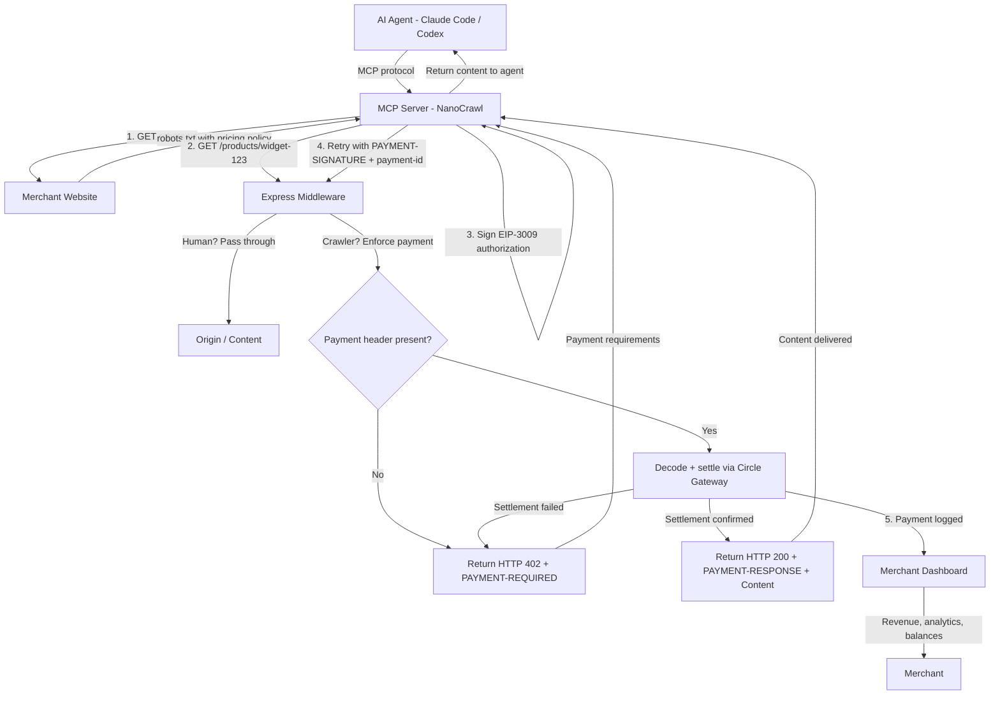

# NanoCrawl: An HTTP-Native Micropayment Protocol for AI Data Access

## ETHGlobal Cannes 2026 — Project Design Document

> **Project Name:** NanoCrawl
> **One-Liner:** An MCP server that lets AI agents autonomously pay for web content via Circle Nanopayments, paired with a publisher middleware that any site installs in one line — turning the web from a gated library into an open marketplace where every page has a price and every agent has a budget.

---

## Table of Contents

1. [Problem Statement](#1-problem-statement) (incl. 1.1 Market Context)
2. [Value Proposition](#2-value-proposition)
3. [Core Design Principles](#3-core-design-principles)
4. [Functionality and User Flows](#4-functionality-and-user-flows)
5. [System Architecture](#5-system-architecture) (incl. 5.2 MCP Server, 5.2.1 Raw Crawler Script)
6. [Payment Infrastructure: Circle Nanopayments and x402](#6-payment-infrastructure-circle-nanopayments-and-x402)
7. [Policy Discovery: Extended robots.txt](#7-policy-discovery-extended-robotstxt)
8. [Enforcement Layer: Reverse Proxy and Edge Gating](#8-enforcement-layer-reverse-proxy-and-edge-gating)
9. [Identity, Trust, and Reputation](#9-identity-trust-and-reputation)
10. [Cross-Chain Considerations](#10-cross-chain-considerations)
11. [Pricing Model](#11-pricing-model)
12. [Developer Experience and Merchant Onboarding](#12-developer-experience-and-merchant-onboarding)
13. [Security, Replay Protection, and Idempotency](#13-security-replay-protection-and-idempotency)
14. [Sponsor Alignment and Prize Strategy](#14-sponsor-alignment-and-prize-strategy)
15. [Hackathon Scope and Delivery Plan](#15-hackathon-scope-and-delivery-plan) (incl. 15.6 Repository File Structure)
16. [Demo Design and Judge Narrative](#16-demo-design-and-judge-narrative) (incl. 16.6 The 30-Second Pitch)
17. [Risks and Mitigations](#17-risks-and-mitigations)
18. [Vision Beyond the Hackathon](#18-vision-beyond-the-hackathon)


---

## 1. Problem Statement

The rise of large language models and AI-driven data systems has created a fundamental economic asymmetry on the web. AI crawlers — operated by companies building LLMs, search engines, recommendation systems, and data aggregation platforms — systematically traverse the internet, extracting the full text of web pages at massive scale. This content is used to train models, populate knowledge bases, and generate commercial products. The content creators — merchants, publishers, news organizations, and anyone maintaining a website with substantive information — receive nothing in return.

This is not a hypothetical concern. As of 2025–2026, the tension between AI companies and content owners has escalated into legal disputes, regulatory proposals, and ad hoc licensing deals. The New York Times sued OpenAI. The EU AI Act introduced transparency requirements around training data. Publishers have started blocking crawlers aggressively, often at the cost of reduced discoverability. The current landscape is a mess of blunt instruments: either you block crawlers entirely (losing potential value), or you let them in for free (losing economic value).

The existing mechanisms for managing crawler access are fundamentally inadequate:

**robots.txt is advisory, not enforceable.** The Robots Exclusion Protocol was designed in 1994 as a voluntary convention. It tells crawlers what they *should not* access, but it provides no mechanism for verification, payment, or consequences. A crawler can read robots.txt and simply ignore it. Critically, the standard itself states that robots.txt rules "are not a form of access authorization." This means that any economic relationship between content owners and crawlers must be enforced at a different layer. That said, robots.txt remains the *only* universally recognized machine-readable policy file on the web — there is no better discovery mechanism. Every major crawler reads it. Rather than replacing robots.txt, we extend it: use it as the *discovery layer* where crawlers learn that a domain charges for access, and enforce the policy at the HTTP and infrastructure layers. This is an honest architectural split — discovery is advisory, enforcement is not.

**Paywalls are designed for humans, not machines.** Traditional paywalls rely on user accounts, session cookies, and subscription models. These are fundamentally ill-suited for automated agents that need to access thousands of pages per hour at sub-cent economics. Requiring a crawler to create a user account, maintain a session, and pay $9.99/month for a subscription is both impractical and economically misaligned.

**Licensing deals are high-friction and exclusive.** Some content owners have struck deals with AI companies (e.g., Reddit with Google, AP with OpenAI). These are bespoke, expensive negotiations accessible only to large publishers and large AI companies. They exclude the long tail of the web — the millions of merchants, bloggers, and specialized sites that collectively hold enormous value but individually lack negotiating power.

**There is no native payment mechanism for web resources — and the emerging x402 standard alone does not solve it.** HTTP has had a 402 Payment Required status code since 1992, but it was never formally specified or widely adopted. The recent x402 protocol (an open standard formalizing 402-based payment negotiation) is a promising step: it defines how a server demands payment and how a client responds with a signed payment payload. However, vanilla x402 settles each payment individually on-chain, which means gas fees per transaction. At crawl scale — hundreds of thousands of pages per domain — the settlement costs destroy the economic model. A crawler paying $0.0001 per page but incurring $0.01 in gas per settlement is losing money on every request. Furthermore, x402 in its basic form returns a 402 response to *every* unpaid request, which creates an unacceptable constraint: **we cannot put any friction on normal human visitors.** A blanket 402 response is not a solution — it would block or confuse every human browser. The system must be invisible to humans and only engage with identified crawlers.

What is needed is not just a payment negotiation protocol, but a complete stack: a way to distinguish crawlers from humans at the edge (before any payment logic fires), a payment method that eliminates per-transaction gas costs through batching, and tooling that makes it trivial for any merchant to adopt. That stack is what this project builds.

The result today is a market failure: content is being consumed at industrial scale without compensation, and the only responses available are either total blocking or total openness. There is no middle ground — no way to say "you can crawl this, but it costs a fraction of a cent per page."

### 1.1 Market Context: What Already Exists and What Doesn't

**What exists:**
- **Cloudflare Pay Per Crawl** (launched July 2025, private beta): Returns 402 to AI crawlers. Cloudflare acts as merchant of record. Stack Overflow is using it. But it is Cloudflare-only — requires sites to be behind Cloudflare. Not available to the millions of sites on Vercel, Netlify, Shopify, WordPress, or custom hosting.
- **x402 Protocol** (Coinbase + Cloudflare, September 2025): Open standard for HTTP-level micropayments using USDC. Defines the 402 negotiation flow. Has processed over 100M transactions across APIs and agents as of 2026.
- **Circle Nanopayments** (launched on testnet March 2026): Gas-free USDC transfers as small as $0.000001. Built on x402. Batched settlement via Gateway. Supports 12+ testnets.

**What doesn't exist — our gap:**
- **No MCP server for paid web browsing.** The x402 protocol exists, but no AI agent tooling implements it as an MCP tool. Claude Code, Codex, and custom agents cannot pay for content today.
- **No platform-agnostic publisher solution.** Cloudflare's solution only works for Cloudflare customers. The vast majority of websites have no pay-per-crawl option.
- **No one-click onboarding.** Cloudflare's solution requires enterprise accounts. We offer an npm install or a deploy button.

This is the gap we fill. We build both sides of the marketplace: the agent wallet (MCP server) and the publisher paywall (middleware toolkit).

---

## 2. Value Proposition

This project introduces **NanoCrawl**: a protocol and reference implementation that converts AI crawling from an uncompensated externality into a programmable, low-friction economic exchange. The core proposition is simple:

> **Humans browse for free. AI crawlers pay per page.**

NanoCrawl is two products, two sides of a marketplace:

1. **MCP Server (agent side):** An MCP-compatible server that any AI agent (Claude Code, Codex, custom agents) connects to. When the agent needs web content, the MCP server hits the publisher's site, discovers the price via HTTP 402, pays via Circle Nanopayments, and returns the content. The agent never handles payments directly.

2. **Publisher Middleware + Toolkit (publisher side):** A Next.js middleware package (`@nanocrawl/next`) that any Vercel-hosted site installs in one line (and future Express/Shopify/WordPress plugins). Normal browser visitors see the site as usual. AI agents get a 402 Payment Required response with the price, pay, and receive content.

This is achieved by combining three capabilities that have only recently become viable together:

### 2.1 HTTP-Native Payment Negotiation (x402) — Enhanced with Nanopayments

The x402 protocol formalizes the use of HTTP 402 Payment Required as a machine-readable payment negotiation mechanism. When a crawler requests a protected page, the server responds with a 402 status and a set of payment requirements encoded in a standard header. The crawler signs a payment authorization, retries the request with the signed payload, and receives the content. This entire exchange happens within the normal HTTP request-response cycle, requiring no out-of-band communication, no separate payment API, and no human intervention.

However, vanilla x402 was designed for individual API calls where per-request settlement is acceptable. For web crawling at scale — where a single agent may access hundreds of thousands of pages on a domain — per-request on-chain settlement is economically unviable. This is where Circle's Nanopayments diverge from standard x402: Nanopayments uses x402 as the *negotiation protocol* but replaces individual on-chain settlement with *batched settlement* through Circle Gateway. The buyer signs off-chain EIP-3009 authorizations (zero gas each), and Gateway aggregates thousands of these into a single on-chain transaction. This is what makes sub-cent pay-per-page economically possible. We are building on x402 as a foundation, but the innovation is in making it work at crawl-level economics.

### 2.2 Gas-Free Sub-Cent Micropayments (Circle Nanopayments)

Circle's Nanopayments system enables payments as low as $0.000001 (one-millionth of a dollar) without per-transaction gas costs. This is achieved through off-chain EIP-3009 payment authorizations that are batched and settled on-chain periodically by Circle's Gateway. The buyer deposits USDC once, then signs authorization after authorization without touching the blockchain. The seller receives funds into a Gateway balance and can withdraw at any time. This makes pay-per-page economically viable: if a page costs $0.0001 to crawl, neither the crawler nor the merchant pays gas on that individual transaction.

### 2.3 Transparent, Progressive Enforcement

The system does not require an all-or-nothing approach. It supports a spectrum of enforcement:

- **Voluntary compliance:** The domain publishes crawl pricing in robots.txt. Well-behaved crawlers read the policy and pay. This alone captures revenue from the largest, most reputation-conscious AI companies.
- **Soft enforcement:** The server returns HTTP 402 for detected crawler requests. Crawlers that support x402 pay automatically. Those that don't receive a clear signal that payment is expected.
- **Hard enforcement:** A reverse proxy (edge layer) distinguishes crawlers from humans using user-agent analysis, request pattern heuristics, and optional identity verification. Non-paying crawlers are blocked or rate-limited.

### 2.4 Why This Matters Now

Three factors make this project timely and competitively relevant:

1. **Regulatory momentum.** Governments worldwide are moving toward requiring transparency and compensation for AI training data. A standardized, low-friction payment protocol positions content owners ahead of regulation rather than behind it.

2. **AI company incentives.** Large AI companies face growing legal and reputational risk from uncompensated data extraction. A compliant crawler that pays per page gains *guaranteed access* to high-quality data while reducing legal exposure. This is not altruism — it is competitive advantage. The best data will increasingly sit behind payment gates, and the crawlers that can pay will have access that non-paying competitors do not.

3. **Technology readiness.** Circle's Nanopayments and Gateway infrastructure, the x402 protocol specification, and the Arc ecosystem provide, for the first time, a complete stack for HTTP-native micropayments at the required price points. This was not possible two years ago.

### 2.5 Positioning

This project is not a paywall. It is not a subscription service. It is not a licensing platform.

It is a **machine-to-machine payment layer for the internet** — an economic primitive that makes it possible for any website to charge any automated agent a fraction of a cent per page, with no setup friction for the user, no gas cost per transaction, and no disruption to human visitors.

Critically, we deliver this as a **frictionless, ready-to-use merchant toolkit.** The vision is not "here is a protocol, go implement it." The vision is: a Shopify merchant installs a plugin, sets a price per page, and starts earning from crawler traffic within minutes. A WordPress site owner adds a plugin and a one-line configuration. A site behind Cloudflare deploys a Worker template. A developer with a custom Express API adds one middleware line. The merchant dashboard shows revenue, crawler activity, and balance in real time. The merchant does not need to understand blockchain, manage keys, or learn about EIP-3009 signatures. This tooling-first approach is what separates a protocol specification from a product — and it is what we demonstrate at the hackathon.

---

## 3. Core Design Principles

### 3.1 Zero Impact on Human Users

The most critical design constraint is that human visitors must never notice the system exists. No login prompts, no cookie banners, no payment gates, no latency increase. The reverse proxy must identify and bypass human traffic in under 1 millisecond. If this principle is violated, adoption will fail regardless of how elegant the payment mechanism is.

### 3.2 HTTP-Native Integration

Payments are not a side channel. They are embedded directly into the HTTP request-response cycle using standard status codes (402) and headers (PAYMENT-REQUIRED, PAYMENT-SIGNATURE, PAYMENT-RESPONSE). This means the protocol works with any HTTP client and any web server. It does not require WebSockets, gRPC, or custom transport layers.

### 3.3 Ultra-Low Pricing with Near-Zero Friction

The economic model only works if the per-page price is extremely low (microcents to fractions of a cent) and the transaction cost is effectively zero. This is non-negotiable. If a crawler pays $0.0001 per page but incurs $0.01 in gas per transaction, the model is dead. Circle's Nanopayments solve this by aggregating thousands of off-chain authorizations into single batch settlements.

### 3.4 Progressive Enforcement

The system supports three escalating enforcement tiers:

1. **Advisory (robots.txt):** Policy discovery only. Compliance is voluntary. However, a compliant crawler that reads the full payment metadata in robots.txt can *proactively* construct and attach payment signatures to its very first request — skipping the 402 round-trip entirely (see Section 4.5).
2. **Protocol-level (HTTP 402 / x402):** The server actively demands payment from detected crawlers that did not pay proactively. Compliant agents pay automatically on the retry.
3. **Infrastructure-level (reverse proxy):** The edge layer blocks or throttles non-paying crawlers before they reach the origin server.

This progression allows merchants to start with zero infrastructure investment (just update robots.txt) and add enforcement layers as they see value.

### 3.5 Merchant Simplicity

Onboarding a merchant should require minimal effort. Ideally: install a middleware package or plugin, set a price, and start earning. The system should not require the merchant to understand blockchain, manage wallets manually, or deploy smart contracts. The payment infrastructure must be abstracted behind developer-friendly tooling. This is where the merchant toolkit (Section 12) becomes the core product: Next.js middleware package, Vercel deploy button, and a hosted dashboard. Future: Shopify plugin, WordPress plugin, Cloudflare Worker template, Express middleware. The merchant's world changes by exactly one middleware file and one config — everything else is handled.

---

## 4. Functionality and User Flows

### 4.1 Standard Flow: Crawler Encounters 402 and Pays (Two-Request)

This is the default interaction flow and what Circle's SDK (`GatewayClient.pay()`) implements out of the box.

**Step 1: Policy Discovery**
The crawler requests `robots.txt` from the merchant's domain. The file contains standard robots directives plus extended fields indicating that crawl access is paid, the price per page, the payment endpoint, and the full payment requirements (payTo address, network, asset). The crawler parses this and stores the pricing policy.

**Step 2: Page Request**
The crawler requests a page (e.g., `/products/widget-12345`). The request passes through the reverse proxy, which identifies the requester as a crawler based on user-agent, request headers, or behavioral signals.

**Step 3: Payment Demand (HTTP 402)**
The proxy (or application server) returns HTTP 402 Payment Required. The response includes a `PAYMENT-REQUIRED` header containing Base64-encoded JSON with the price, accepted token (USDC), accepted network (e.g., Arc Testnet), the seller's payment address, and the Gateway verifying contract details.

**Step 4: Payment Authorization**
The crawler's x402 client parses the payment requirements, constructs an EIP-3009 `transferWithAuthorization` payload (specifying amount, sender, recipient, validity window, and nonce), signs it with the crawler's private key, and Base64-encodes the signed payload.

**Step 5: Retry with Payment**
The crawler retries the same request, now including a `PAYMENT-SIGNATURE` header containing the signed authorization and optionally a `X-PAYMENT-ID` header for idempotency.

**Step 6: Verification and Settlement**
The server (or middleware) decodes the payment signature, calls Circle Gateway's `settle()` function to verify and lock the payment. The Gateway validates the signature, checks the buyer's balance, and confirms the authorization. This happens with low latency — the seller does not wait for on-chain confirmation. The actual on-chain settlement happens later when Gateway batches accumulated authorizations.

**Step 7: Content Delivery**
The server returns the requested content with HTTP 200 and a `PAYMENT-RESPONSE` header containing the settlement confirmation. Optionally, a signed receipt is included for auditability.

**Step 8: Dashboard Update**
The merchant's dashboard updates in real time, showing the crawler's request, the amount paid, and the accumulated revenue.

### 4.5 Optimized Flow: Proactive Payment (Single-Request)

The standard two-request flow (request → 402 → sign → retry) works well for individual API calls but introduces unnecessary overhead when a crawler intends to access hundreds or thousands of pages on the same domain. The 402 round-trip for every single page doubles the number of HTTP requests.

**Key insight:** If the robots.txt (or a `.well-known/ai-pay` metadata endpoint) publishes the *complete* payment requirements — payTo address, network, asset, price, and Gateway verifying contract — then a compliant crawler already has everything it needs to construct a valid EIP-3009 authorization *before* making the first request. The crawler can attach the `PAYMENT-SIGNATURE` header proactively on the initial request, skipping the 402 entirely.

**Proactive flow:**

1. Crawler reads robots.txt → extracts full payment metadata
2. For each page: crawler constructs EIP-3009 authorization locally, attaches `PAYMENT-SIGNATURE` header
3. Server receives the request *with payment already attached* → calls `settle()` → returns content immediately
4. No 402 round-trip. Single HTTP request per page.

**Is this composable with Circle's infrastructure?** Yes. On the seller side, Circle's `BatchFacilitatorClient.settle(payload, requirements)` accepts any valid signed authorization — it does not care whether the payment was prompted by a 402 or attached proactively. The seller middleware can check for the presence of a `PAYMENT-SIGNATURE` header and, if present, skip the 402 response and go directly to settlement. On the buyer side, this requires a custom client (not `GatewayClient.pay()`, which hardcodes the 402 flow) that constructs authorizations from cached payment metadata.

**Recommendation for the hackathon:** Implement the standard two-request flow using `GatewayClient.pay()` for the MVP — it is faster to build and directly uses Circle's SDK. Design and describe the proactive single-request flow as a **critical optimization for production** and show the robots.txt metadata format that enables it. If time permits, implement a proof-of-concept proactive client using `BatchFacilitatorClient.settle()` directly. The performance difference at scale is significant: a crawler accessing 100,000 pages saves 100,000 HTTP round-trips.

### 4.2 Secondary Flow: Human Browsing (Unaffected)

A human visitor requests the same page. The reverse proxy detects that the request comes from a standard browser (based on user-agent, headers, and behavior). The request bypasses all payment logic entirely and reaches the origin server directly. The human sees the page with no delay, no payment prompt, and no indication that the system exists.

### 4.3 Tertiary Flow: Non-Compliant Crawler

A crawler requests a page but does not include any payment headers. The reverse proxy identifies it as a crawler. The server returns HTTP 402. The crawler does not support x402 and cannot pay. Depending on configuration, the merchant can:

- Return a polite error message explaining the payment requirement
- Rate-limit the crawler to a small number of free pages
- Block the crawler entirely
- Log the attempt for analytics

This flow is important for the demo: showing the difference between compliant and non-compliant crawlers makes the value proposition tangible for judges.

### 4.4 Flow Variant: Licensed / Allowlisted Crawler

An enterprise crawler (e.g., Google for SEO indexing) presents a pre-authorized token or API key. The reverse proxy recognizes this as an allowlisted entity and grants free or discounted access. This accommodates the reality that some crawlers (search engine indexers) provide value to the merchant through discoverability and should not be charged.

---

## 5. System Architecture

The system consists of five primary components:

```
AI Agent (Claude Code, Codex, custom)
    ↓ MCP protocol
MCP Server (manages wallet, budget, receipts)
    ↓ HTTP with x402 headers
    ↓ discovers prices, signs EIP-3009, retries with payment
Circle Nanopayments (gas-free USDC via x402 standard)
    ↓
Next.js Middleware (@nanocrawl/next)
    ↓ classifies traffic, verifies payment, serves content
Next.js App (merchant site + dashboard + landing page)
```

1. **MCP Server** — agent-side Node.js component that wraps payment logic for AI agents
2. **Next.js App** — publisher-side: middleware for payment enforcement, merchant site, dashboard, landing page (all in one)
3. **Circle Gateway** — settlement infrastructure (off-chain batching, on-chain settlement)

### 5.1 Merchant Server (Seller Backend)

**The critical constraint:** merchants will not change their existing infrastructure. A Shopify store will remain on Shopify. A WordPress site will remain on WordPress. A site fronted by Cloudflare will keep Cloudflare. Our system must integrate *with* the merchant's existing stack, not replace it.

The following integration patterns map to real-world merchant setups:

**Pattern A: Express / Node.js backend (Circle's native path)**
Circle provides an Express middleware package (`@circle-fin/x402-batching`) that makes integration a one-liner. Install `@circle-fin/x402-batching`, `@x402/core`, `@x402/evm`, and `viem`. Create middleware with `createGatewayMiddleware({ sellerAddress })` and protect routes with `gateway.require("$0.01")`. The middleware handles 402 generation and settlement automatically. For custom pricing, use `BatchFacilitatorClient.settle(payload, requirements)` directly. This is Circle's reference implementation and the easiest path for Express/Node.js backends. ([Seller quickstart](https://developers.circle.com/gateway/nanopayments/quickstarts/seller))

**Pattern B: Cloudflare-fronted site (CF Worker as edge gate)**
The vast majority of commercial websites use Cloudflare or a similar CDN/reverse-proxy. Here, the integration point is a Cloudflare Worker that:
1. Classifies incoming traffic (human vs. crawler) — sub-millisecond check
2. Passes human traffic through to origin with zero modification
3. Intercepts crawler traffic and either checks for an attached `PAYMENT-SIGNATURE` or returns 402
4. On valid payment, calls Circle Gateway's `settle()` endpoint via fetch, then proxies the request to the origin

The Worker does not need the full Express middleware — it calls the Gateway REST API directly. This is the **production deployment model** and arguably the most powerful integration: every CF-enabled site can add pay-per-crawl by deploying a single Worker template.

**Pattern C: Shopify / WordPress (plugin + hosted proxy)**
Shopify and WordPress merchants cannot deploy custom server middleware. The integration model is:
1. A plugin generates the extended robots.txt and adds a `<meta>` tag or `.well-known/ai-pay` endpoint with payment metadata
2. Crawler traffic is routed through a lightweight hosted proxy (or CF Worker) that handles the 402/payment logic
3. The proxy calls the merchant's origin for actual content, only after payment is verified

This requires a small hosted service (which could itself be a Cloudflare Worker) acting as the payment gateway between the crawler and the merchant's origin. The plugin handles configuration (price, wallet address) and the dashboard.

**Pattern D: Static sites / JAMstack**
For sites hosted on Vercel, Netlify, or similar: a serverless function at the edge performs the same role as the CF Worker. The robots.txt extension is generated at build time.

**For the hackathon demo:** We use **Pattern D (Next.js on Vercel)**. The Next.js middleware handles traffic classification (human vs. crawler) and returns 402 responses with x402 payment requirements. Payment verification calls Circle Gateway's `settle()` REST API directly from the middleware or from a Next.js API route — no Express dependency needed. The dashboard and landing page are routes within the same Next.js app. Deployment is `git push` to Vercel.

**Why Next.js over Express?** Circle's `createGatewayMiddleware` is Express-native, but the underlying operation is a single `settle()` call — a POST request to Gateway's REST API with the signed authorization payload. This is trivially reproducible with `fetch()` from Next.js middleware or an API route. The tradeoff is we lose the convenience of Circle's prebuilt Express middleware but gain: (a) Vercel's edge deployment (global, sub-millisecond cold start), (b) the dashboard and landing page in the same app, and (c) one-click deploy for any Next.js site.

The demo should make clear: "Here is what changes for the merchant" — a `middleware.ts` file, a `nanocrawl.config.ts`, and a robots.txt update. One deploy button.

### 5.2 MCP Server (Agent-Side Buyer)

The MCP server is the primary buyer-side component. It is an MCP-compatible (Model Context Protocol) server that any AI agent — Claude Code, Codex, or custom agents — can connect to. The agent calls tools like `browse(url)` and the MCP server handles all payment logic transparently.

**Why MCP, not a raw script?** MCP is the standard protocol for connecting AI agents to external tools. Claude Code, Codex, and a growing ecosystem of agents support it natively. By exposing paid web browsing as an MCP tool, we make it trivially easy for *any* agent to access paid content. The agent doesn't need to know about x402, EIP-3009, or Circle Gateway — it just calls `browse(url)` and gets content back.

**MCP Tools exposed to the agent:**

| Tool | Description |
|------|-------------|
| `browse(url)` | Pay for and retrieve content from a URL. Handles 402 negotiation, payment, and retry automatically. |
| `peek(url)` | Check the price of a URL without paying. Returns price, currency, network. |
| `get_balance()` | Check remaining Gateway balance and session spend. |
| `get_receipts()` | Return payment log with URLs, amounts, and timestamps. |
| `set_budget(max)` | Set a spending cap for the session. |

**Internal services:**

| Service | Responsibility |
|---------|---------------|
| `PaymentService` | Wraps `GatewayClient` — handles deposits, payment signing, and balance checks |
| `CrawlService` | HTTP client that makes requests, parses 402 responses, retries with payment |
| `BudgetManager` | Tracks cumulative spend, enforces per-session and per-request limits |
| `ReceiptStore` | Persists payment receipts (in-memory for hackathon, SQLite for production) |

**Payment flow inside `browse(url)`:**

```typescript
async function browse(url: string) {
  // GatewayClient.pay() handles the full x402 flow:
  // 1. Request URL → receive 402 + PAYMENT-REQUIRED header
  // 2. Parse payment requirements (price, payTo, network, scheme)
  // 3. Sign EIP-3009 authorization (off-chain, zero gas)
  // 4. Retry with PAYMENT-SIGNATURE header
  // 5. Receive content
  const { data, status } = await gatewayClient.pay(url);

  receiptStore.save({ url, amount, timestamp: Date.now() });
  budgetManager.recordSpend(amount);

  return { content: data, paid: true, cost: amount };
}
```

Circle's `GatewayClient` class handles the standard two-request flow internally. Initialize with `GatewayClient({ chain: "arcTestnet", privateKey })`, deposit USDC if the balance is low via `client.deposit("1")` (this is the one on-chain moment — see Section 5.7), check balances with `client.getBalances()`. ([Buyer quickstart](https://developers.circle.com/gateway/nanopayments/quickstarts/buyer), [`@circle-fin/x402-batching` npm package](https://www.npmjs.com/package/@circle-fin/x402-batching))

For the demo, we show the deposit step explicitly as part of the MCP server setup — the agent funds its Gateway wallet, and this transaction is visible on-chain (Blockscout for Arc Testnet). This makes the "blockchain moment" tangible for judges.

**Demo wow moment:** Claude Code is asked to "research the latest sneaker prices." It calls `browse()` on several paid product pages. The terminal shows payments being made. The publisher dashboard lights up with revenue. The agent never touched a private key or knew about blockchain.

### 5.2.1 Raw Crawler Script (Testing Alternative)

For integration testing and simpler demonstrations, a standalone Node.js script wraps `GatewayClient.pay()` directly without the MCP layer. This is useful for:
- Testing the seller backend before the MCP server is ready
- Demonstrating the payment flow in a terminal without an AI agent
- The proactive payment flow (Section 4.5) which constructs authorizations from robots.txt metadata

### 5.3 Reverse Proxy / Edge Layer

A middleware layer (conceptually a Cloudflare Worker or similar edge function) that sits between the internet and the merchant's origin server. Key responsibilities:

- Classify incoming requests as human or crawler
- Route human traffic directly to the origin (zero overhead)
- Route crawler traffic through the payment enforcement pipeline
- Manage allowlists for trusted crawlers (e.g., Googlebot for SEO)
- Rate-limit or block non-compliant crawlers

**Hackathon implementation: Next.js middleware on Vercel.**

The reverse proxy / edge gating functionality is handled by Next.js middleware (`middleware.ts`), which runs at the edge on Vercel before requests reach the application. This middleware:
- Classifies traffic using the multi-signal approach (Section 8)
- Passes humans through with zero modification
- Returns 402 with x402 `PAYMENT-REQUIRED` headers to detected crawlers
- Checks for existing `PAYMENT-SIGNATURE` headers and routes to verification

Payment verification is handled by a Next.js API route (`/api/verify-and-serve`) that calls Circle Gateway's `settle()` REST API. This replaces the need for a separate reverse proxy or Express middleware.

**Production vision:** For non-Vercel sites, the same classification and payment logic can run as a Cloudflare Worker, Express middleware, or Shopify plugin. The Next.js implementation is the hackathon reference; the core logic (classify → 402 → verify → serve) is platform-agnostic.

### 5.4 Merchant Dashboard

A Next.js page at `/nanocrawl/dashboard` that provides merchants with real-time visibility into their crawl revenue. Key features:

- **Live revenue counter** — total USDC earned, updating in real time as payments arrive
- **Transaction feed** — crawler address, page accessed, amount paid, timestamp, with on-chain explorer links where available
- **Revenue by route** — breakdown by URL pattern (`/products/*` vs `/blog/*` vs `/api/*`)
- **Gateway balance** — current balance available for withdrawal
- **Withdraw button** — triggers on-chain USDC transfer from Gateway to merchant's wallet (calls `/api/withdraw`). Shows Blockscout link to the withdrawal transaction. **This is the critical blockchain interaction point** — the merchant clicks one button and sees real USDC arrive in their on-chain wallet.
- **Top paying agents** — which crawlers are spending the most
- Indication of cached (idempotent) versus freshly paid requests

The dashboard polls `/api/payments` and `/api/balances` for live updates. The "Withdraw" button calls `/api/withdraw`, which internally uses `GatewayClient.withdraw()` and returns the transaction hash for display.

This is the second screen during the demo (Person B's laptop). Judges stare at dashboards — it must look polished.

### 5.5 Optional: Trust and Reputation Layer

An extension that addresses the problem of low-quality "bloat domains" — sites that produce low-value content specifically to extract micropayments from crawlers. This could include:

- A domain reputation registry (on-chain or off-chain) where domains are scored based on traffic, content quality, domain age, and community curation
- Crawler-side filtering that only pays for domains above a quality threshold
- Staking mechanisms where domains deposit tokens to signal commitment to quality

This is a post-hackathon extension but should be mentioned in the presentation as a critical component of the ecosystem vision.

### 5.6 Optional: Cross-Chain Withdrawal

A feature demonstrating that merchants can receive payments on one network and withdraw earnings to another. Circle's Gateway supports cross-chain withdrawals — the SDK documents `withdraw()` with an optional destination chain parameter. For the demo, this means: pay and settle on Arc Testnet (fast), then show a withdrawal to Base Sepolia or Ethereum Sepolia to demonstrate chain-agnostic settlement.

### 5.7 On-Chain Interaction Points and Blockchain Visibility

This deserves honest discussion because it is strategically important for ETHGlobal.

Circle Nanopayments deliberately abstract away the blockchain. The entire point is gasless, off-chain authorization with batched settlement. From a product perspective, this is excellent — the blockchain is invisible infrastructure. But for a blockchain hackathon, judges expect to see on-chain activity. A project that runs entirely off-chain, with no block explorer moment, may feel like "just a payment API integration" rather than a blockchain project.

**The concern is valid.** The system has three distinct on-chain interaction points. All three should be visible in the demo.

#### On-Chain Moment 1: Crawler Deposits USDC into Gateway (Beginning)

The crawler (MCP server) funds its Gateway wallet before browsing. This is an on-chain transaction.

```typescript
// MCP server setup — Person A
const client = new GatewayClient({ chain: "arcTestnet", privateKey: CRAWLER_KEY });
const tx = await client.deposit("1"); // deposit 1 USDC
console.log(`Deposit tx: https://explorer.arc.circle.com/tx/${tx.hash}`);
```

This produces a transaction hash visible on Blockscout/Arc Explorer. Demo line: *"The agent funds its payment wallet — here it is on-chain."*

#### On-Chain Moment 2: Gasless Nanopayments (Middle — Off-Chain)

During crawling, every `browse(url)` call signs an EIP-3009 authorization off-chain. No gas, no on-chain transaction per page. This is the core product feature. Gateway accumulates these authorizations.

Demo line: *"The agent just browsed 50 pages at $0.001 each. Zero gas. Every payment is a signed authorization held by Gateway."*

The dashboard shows payments accumulating in real time — the merchant sees revenue growing even though nothing has settled on-chain yet.

> **Question for Circle team:** After `settle()` returns success for a nanopayment, does the seller's Gateway balance update immediately (before on-chain batch), or only after the batch settles? This affects what we show on the dashboard and whether the merchant can withdraw immediately.

#### On-Chain Moment 3: Merchant Withdraws Revenue (End)

This is the critical blockchain moment that is currently underspecified. After accumulating revenue from crawler payments, the merchant explicitly requests a withdrawal. This triggers an on-chain USDC transfer from Gateway to the merchant's wallet.

```typescript
// Merchant withdrawal — triggered from dashboard or script
const merchantClient = new GatewayClient({ chain: "arcTestnet", privateKey: MERCHANT_KEY });
const balance = await merchantClient.getBalances();
console.log(`Gateway balance: ${balance.usdc} USDC`);

const withdrawTx = await merchantClient.withdraw(balance.usdc);
console.log(`Withdrawal tx: https://explorer.arc.circle.com/tx/${withdrawTx.hash}`);
// USDC now visible in merchant's on-chain wallet
```

**This should be a dashboard action.** The merchant dashboard includes a "Withdraw" button. Clicking it calls the withdrawal endpoint, which triggers the on-chain transaction. The dashboard then shows the Blockscout link to the withdrawal transaction. This is the payoff moment for judges: *"The merchant earned $0.47 from 470 crawler page views. Here is the USDC arriving in their wallet — on-chain, verifiable, real."*

**Implementation detail:** The withdrawal can be triggered from:
- A button in the merchant dashboard (calls a `/api/withdraw` endpoint)
- A CLI script (`scripts/withdraw.ts`)
- The MCP server itself (if we want to demo "agent triggers merchant withdrawal" — probably unnecessary)

For the hackathon, the dashboard button is the strongest demo path. It makes the flow visceral: accumulated micropayments → one click → real money on-chain.

#### On-Chain Moment 3b: Gateway Batch Settlement (Background)

When Gateway periodically settles accumulated authorizations, it creates an on-chain batch transaction. We cannot control when this happens, but if we can capture one during the demo, it is a powerful bonus: *"Gateway just settled 47 nanopayments in a single transaction."*

> **Question for Circle team:** How frequently does Gateway batch-settle on Arc Testnet? Can we observe or trigger a batch for the demo?

#### Recommended Demo Arc

The demo follows a clear blockchain narrative:

1. **Money goes on-chain** — crawler deposits USDC (Blockscout link)
2. **Hundreds of gasless micropayments** — off-chain, instant, dashboard updating live
3. **Money comes back on-chain** — merchant clicks "Withdraw," USDC arrives in wallet (Blockscout link)

This gives judges the complete story: blockchain as settlement layer, not overhead. The blockchain moments bookend the demo; the product magic (gasless micropayments) happens in the middle.

**Chain choice:** Arc Testnet is the best choice for demo reliability. ~0.5 second attestation time (1 block), compared to 13-19 minutes for Base Sepolia, Ethereum Sepolia, Arbitrum Sepolia, and others. Deposits and withdrawals confirm almost instantly. Nanopayments are supported on 12 testnets ([supported blockchains](https://developers.circle.com/gateway/references/supported-blockchains)), but Arc Testnet is the only one where a live deposit/withdrawal won't make judges wait.

---

## 6. Payment Infrastructure: Circle Nanopayments and x402

### 6.1 Why Nanopayments Are Essential

The entire economic model of pay-per-crawl depends on the ability to charge sub-cent amounts per page with effectively zero transaction costs. Consider the math:

- A large e-commerce site has 500,000 product pages
- A major LLM crawler visits all of them
- At $0.0001 per page, the total crawl costs $50
- At $0.001 per page, the total crawl costs $500

These are economically meaningful amounts for the merchant while being trivially small for an AI company spending millions on compute. But they only work if the per-transaction cost is near zero. On Ethereum mainnet, a single token transfer costs $0.50–$5.00 in gas. That is 5,000x to 50,000x the price of a single page access.

Circle's Nanopayments solve this by decoupling authorization from settlement. The buyer signs an off-chain EIP-3009 authorization for each page access. These authorizations are collected by the Gateway and settled in batches on-chain. The result: thousands of micropayments, one on-chain transaction.

### 6.2 How Nanopayments Work (Detailed)

**Deposit Phase:** The crawler deposits USDC into the Circle Gateway wallet contract on the chosen network (e.g., Arc Testnet). This is a one-time on-chain transaction. The deposited amount becomes the crawler's available balance within the Gateway.

**Authorization Phase:** For each page access, the crawler constructs an EIP-3009 `transferWithAuthorization` payload. This payload specifies:
- `from`: the crawler's Gateway address
- `to`: the merchant's Gateway address
- `value`: the page price (e.g., 100 base units = $0.0001 with 6 decimal USDC)
- `validAfter`: typically 0 or a recent timestamp
- `validBefore`: **must be at least 3 days in the future** — this is a hard Gateway requirement that will silently break demos if missed
- `nonce`: a unique value per authorization

The crawler signs this payload with their private key. This signature is entirely off-chain — no gas, no on-chain transaction, sub-millisecond latency.

**Verification Phase:** The merchant's server receives the signed authorization (via the `PAYMENT-SIGNATURE` HTTP header) and forwards it to Circle Gateway's `settle()` endpoint. The Gateway operates within a Trusted Execution Environment (AWS Nitro Enclave) that verifies the EIP-3009 signature, checks the buyer's available balance, and "locks" the funds internally. The merchant's available balance increases immediately.

**Settlement Phase:** Periodically (based on Gateway's internal batching schedule), all accumulated authorizations are aggregated and settled in a single on-chain batch transaction. The merchant can withdraw their accumulated balance at any time — either on the same chain (instant) or cross-chain (via Gateway's withdrawal mechanism).

### 6.3 x402 Protocol Details — and How Nanopayments Fits In

x402 is a *negotiation protocol*, not a payment method. It defines the HTTP-level conversation; the actual payment mechanics are pluggable via "schemes." This is the critical architectural point that answers both backward compatibility and the single-page use case.

**The three HTTP headers (same for all x402 schemes):**

**`PAYMENT-REQUIRED` (Server → Client):** Included with HTTP 402 responses. Contains Base64-encoded JSON with an `accepts` array — each entry is a payment option the server will honor. Each option specifies:
- `scheme`: the payment method identifier (e.g., `"exact"` for direct on-chain, or `"exact"` with a `GatewayWalletBatched` domain for Nanopayments)
- `network`: the chain identifier (e.g., `"eip155:5042002"` for Arc Testnet)
- `asset`: the USDC contract address
- `amount`: the price in base units (e.g., `"10000"` = $0.01 with 6 decimals)
- `payTo`: the seller's address
- `extra`: scheme-specific metadata — for Nanopayments, this contains `{ name: "GatewayWalletBatched", version: "1", verifyingContract: "0x..." }`

**`PAYMENT-SIGNATURE` (Client → Server):** The client's signed payment payload. For Nanopayments, this is a Base64-encoded JSON containing an EIP-3009 `TransferWithAuthorization` signed against the `GatewayWalletBatched` EIP-712 domain (not the standard USDC domain).

**`PAYMENT-RESPONSE` (Server → Client):** Settlement confirmation, returned with the 200 response.

**What changes between standard x402 and Nanopayments at this level?**

| Aspect | Standard x402 (`exact` scheme) | Nanopayments (`exact` + Gateway batching) |
|--------|-------------------------------|------------------------------------------|
| EIP-712 domain | Standard USDC token domain | `GatewayWalletBatched` (custom domain with `verifyingContract` = Gateway Wallet) |
| Settlement | Per-request on-chain transaction (gas per payment) | Off-chain authorization → batched on-chain settlement (zero gas per payment) |
| Fund source | Buyer's wallet balance on-chain | Buyer's Gateway balance (pre-deposited) |
| Facilitator | Any x402 facilitator (Coinbase, etc.) | Circle Gateway's `settle()` endpoint specifically |
| `extra` field in `accepts` | Absent or minimal | Contains `name: "GatewayWalletBatched"`, `version`, `verifyingContract` |

The key insight: **they use the same x402 headers and the same negotiation flow.** The difference is in the `extra` field of the payment requirements and in the EIP-712 domain used for signing. A server can advertise *both* standard x402 and Nanopayments in the `accepts` array, and the client picks whichever scheme it supports. This means:

1. **A client that only supports standard x402** (direct on-chain settlement) can still pay for a single page — it just costs gas. This works, and nothing breaks.
2. **A client that supports Nanopayments** picks the `GatewayWalletBatched` option, signs against the custom domain, and pays gas-free through batching.
3. **The server does not need to know** which scheme the client chose until it receives the `PAYMENT-SIGNATURE` and routes it to the appropriate facilitator.

**For our use case:** We should advertise Nanopayments as the primary (and recommended) scheme, since it is the only one economically viable for crawl-scale access. But we *can* include a standard `exact` scheme option for one-off access. This is a nice story for judges: "Nanopayments for bulk crawling, standard x402 for individual pages."

> **Question for Circle team:** Can a seller's `accepts` array include both a `GatewayWalletBatched` option and a standard `exact` (on-chain) option simultaneously? If so, does the `createGatewayMiddleware` support this dual-mode configuration, or do we need to construct the 402 response manually?

### 6.4 Signed Offers and Receipts (Extension)

The x402 specification includes an extension for cryptographic proof-of-interaction:

- **Signed Offers:** The server signs the payment terms (price, resource, timestamp) with a dedicated signing key and includes the signature in the 402 response. This provides the crawler with cryptographic proof that the server offered specific terms.
- **Signed Receipts:** After settlement, the server signs a receipt confirming delivery and includes it in the 200 response. This provides both parties with auditable, non-repudiable proof of the exchange.

The x402 documentation explicitly recommends using a dedicated signing key separate from the payment address (`payTo`). This separation of duties is important for security: compromise of the signing key does not grant access to funds.

### 6.5 Implementation Guidance for the Hackathon

**Use `settle()` directly.** Circle's documentation explicitly recommends calling `settle()` in the hot path rather than `verify()` followed by `settle()`. The settle endpoint "has low latency and guarantees settlement." This simplifies the middleware and reduces demo failure risk.

**Set `validBefore` to now + 5 days.** The minimum is 3 days, but adding margin prevents edge cases from breaking the demo during the event.

**Generate a fresh nonce per payment.** Do not reuse nonces. Use UUID v4 or a cryptographically random value.

**Use Arc Testnet for the demo.** Circle's supported-blockchains table shows Arc Testnet with ~1 block / ~0.5 seconds average attestation time, compared to ~65 blocks / ~13–19 minutes for some other testnets. This makes deposits and withdrawals fast enough for a live demo.

---

## 7. Policy Discovery: Extended robots.txt

### 7.1 Purpose

robots.txt serves as the policy discovery mechanism. Its role depends on which payment flow the crawler uses:

**Standard flow (two-request):** The crawler reads robots.txt to learn *that* the domain charges for crawling and at what price. When it requests a page, it receives a 402 with full payment requirements. robots.txt is informational only — the 402 response carries the authoritative payment metadata.

**Proactive flow (single-request, Section 4.5):** The crawler reads robots.txt to extract the *complete* payment requirements — payTo address, network, asset, amount, and Gateway verifying contract. With this information, the crawler constructs and signs EIP-3009 authorizations *before* requesting any page, attaching the `PAYMENT-SIGNATURE` header on the first request. robots.txt becomes the *authoritative source* of payment metadata, eliminating the 402 round-trip. This is the performance-critical path for bulk crawling.

The robots.txt format must therefore carry enough information for both flows.

### 7.2 Proposed Extension Format

**Minimal format (sufficient for standard flow):**
```
User-agent: *
Allow: /

User-agent: AI-Crawler
Allow: /
Crawl-fee: 0.0001 USDC
Payment-Endpoint: https://merchant.com/.well-known/ai-pay
Accepted-Chains: arcTestnet
```

**Full format (enables proactive single-request flow):**
```
User-agent: AI-Crawler
Allow: /
Crawl-fee: 0.0001 USDC
Payment-Network: eip155:5042002
Payment-Asset: 0x...USDC_ADDRESS
Payment-PayTo: 0x...SELLER_ADDRESS
Payment-Scheme: GatewayWalletBatched
Payment-VerifyingContract: 0x...GATEWAY_WALLET_ADDRESS
Payment-Endpoint: https://merchant.com/.well-known/ai-pay
```

Extended fields:
- `Crawl-fee`: Default per-page price in USDC
- `Payment-Endpoint`: URL where the crawler can initiate payment negotiation (the x402 endpoint — also used as fallback if proactive payment is rejected)
- `Payment-Network`: Chain identifier in CAIP-2 format (e.g., `eip155:5042002` for Arc Testnet)
- `Payment-Asset`: USDC contract address on the specified network
- `Payment-PayTo`: Seller's EVM address for receiving payments
- `Payment-Scheme`: Payment scheme name (e.g., `GatewayWalletBatched` for Nanopayments)
- `Payment-VerifyingContract`: Gateway Wallet contract address (needed for EIP-712 domain construction)

With the full format, a compliant crawler has all the parameters needed to construct a valid EIP-3009 authorization without ever receiving a 402 response. This is the metadata that `GatewayClient` normally extracts from the 402's `accepts` array — we publish it upfront.

> **Question for Circle team:** Is there a canonical way to discover the `verifyingContract` (Gateway Wallet address) and USDC asset address for a given chain, other than reading the 402 response? We want to confirm the testnet addresses for Arc Testnet so the robots.txt metadata is always consistent with what Gateway expects.

An alternative (or complement) to robots.txt is a `.well-known/ai-pay` JSON endpoint that returns the same information in structured JSON. This is more robust for complex configurations (tiered pricing, multiple schemes) and easier to parse programmatically. For the hackathon, robots.txt is sufficient.

### 7.3 Tiered Pricing (Extension)

For merchants who want different prices for different content sections:

```
User-agent: AI-Crawler
Allow: /
Crawl-fee: 0.0001 USDC
Crawl-fee: /premium/* 0.0005 USDC
Crawl-fee: /api/* 0.001 USDC
Payment-Endpoint: https://merchant.com/.well-known/ai-pay
Accepted-Chains: arcTestnet
```

This is a post-MVP extension. For the hackathon, flat per-page pricing is sufficient.

### 7.4 Limitations and Honest Framing

robots.txt is inherently advisory. A non-compliant crawler can read the pricing policy and ignore it entirely. The robots.txt extension is a discovery mechanism, not an enforcement mechanism. Enforcement happens at the HTTP layer (402 responses) and the infrastructure layer (reverse proxy). This distinction is important for the presentation — judges will respect honest framing of limitations more than overclaiming.

### 7.5 Toward an Open Standard

The long-term vision is for this robots.txt extension (or a `.well-known/ai-policy` JSON file) to become an industry standard. If adopted broadly, it creates a machine-readable economic layer across the web that any compliant crawler can navigate automatically. This is the "new economic layer of the internet" narrative that resonates with both technical judges and ecosystem thinkers.

---

## 8. Enforcement Layer: Reverse Proxy and Edge Gating

### 8.1 Why Enforcement Matters

Without enforcement, pay-per-crawl is a polite suggestion that only works for the most cooperative agents. With enforcement, it becomes a real access control mechanism. The enforcement layer is what transforms the protocol from an honor system into a market.

### 8.2 Traffic Classification

The reverse proxy's primary job is to classify every incoming request as one of:

1. **Human traffic** → bypass all payment logic, serve immediately
2. **Known-good crawler** → check allowlist, serve with or without payment based on policy
3. **Unknown crawler** → enforce payment via HTTP 402
4. **Known-bad actor** → block or rate-limit

Classification signals include:
- **User-agent string:** The simplest signal. LLM crawlers typically identify themselves (e.g., "GPTBot", "Claude-Web", "Bingbot"). Not reliable alone (can be spoofed), but a useful first filter.
- **Self-declared crawler headers:** A compliant crawler can include headers like `X-AI-Crawler-ID` to signal its identity and willingness to pay. This is the cooperative path.
- **Request patterns:** Crawlers exhibit distinctive behavior — high request rates, sequential URL traversal, lack of JavaScript execution, absence of cookies and session state.
- **IP reputation:** Known crawler IP ranges can be allowlisted or flagged.
- **World ID verification (extension):** For the strongest human-vs-machine distinction, World ID proof-of-personhood can be used to verify that a request originates from a real human.

### 8.3 Latency Requirement

The classification check for human traffic must complete in under 1 millisecond. This is a hard requirement. If the payment system adds noticeable latency to human browsing, merchants will not adopt it. The check for human traffic should be a simple in-memory lookup — user-agent string match and the absence of crawler-specific headers.

### 8.4 Hackathon Implementation

**Decision: Next.js middleware for the hackathon.** The Next.js middleware runs at the edge on Vercel, handles traffic classification and 402 response generation, and calls Circle Gateway's `settle()` REST API for payment verification. The dashboard and landing page are routes within the same Next.js app.

The classification logic lives in `middleware.ts`. It uses multiple signals — not just user-agent matching — to distinguish humans from bots reliably:

```typescript
// middleware.ts — Next.js edge middleware
import { NextRequest, NextResponse } from 'next/server';
import { nanocrawlConfig } from './nanocrawl.config';

function classifyRequest(request: NextRequest): "human" | "crawler" {
  const ua = request.headers.get("user-agent")?.toLowerCase() || "";

  // Explicit paid-agent signal (MCP server or compliant crawler)
  if (request.headers.get("payment-signature")) return "crawler";
  if (request.headers.get("x-nanocrawl-capable")) return "crawler";

  // Known bot user-agents
  const isKnownBot = /bot|crawler|spider|claude|gpt|anthropic|openai|perplexity|cohere|bytespider|ccbot|curl|python-requests|fetch/i.test(ua);
  if (isKnownBot) return "crawler";

  // Missing browser-standard headers — real browsers always send these
  const hasAcceptLanguage = request.headers.get("accept-language");
  const hasSecFetchDest = request.headers.get("sec-fetch-dest");
  if (!hasAcceptLanguage && !hasSecFetchDest) return "crawler";

  // Suspiciously short user-agent — real browsers have 80+ char UAs
  if (ua.length > 0 && ua.length < 20) return "crawler";

  return "human";
}

export function middleware(request: NextRequest) {
  if (classifyRequest(request) === "human") {
    return NextResponse.next(); // zero friction for humans
  }

  // Crawler detected — check for payment header
  const paymentSig = request.headers.get("payment-signature");
  if (paymentSig) {
    // Verify payment via /api/settle route (calls Circle Gateway settle())
    // If valid, serve content; if invalid, return 402
    return NextResponse.rewrite(new URL('/api/verify-and-serve', request.url));
  }

  // No payment — return 402 with x402 PAYMENT-REQUIRED header
  return serve402(request, nanocrawlConfig);
}
```

**Payment verification** is handled by a Next.js API route (`/api/verify-and-serve`) that calls Circle Gateway's `settle()` REST API. This replaces the need for Express's `createGatewayMiddleware`:

```typescript
// app/api/verify-and-serve/route.ts
export async function POST(request: Request) {
  const paymentPayload = request.headers.get("payment-signature");
  // Call Circle Gateway settle() endpoint
  const settled = await fetch("https://gateway.circle.com/v1/settle", {
    method: "POST",
    headers: { "Content-Type": "application/json" },
    body: JSON.stringify({ payload: paymentPayload, requirements }),
  });
  if (settled.ok) {
    // Log payment, serve content
  } else {
    // Return 402
  }
}
```

> **Question for Circle team:** What is the exact REST API endpoint and request format for `settle()`? The SDK uses `BatchFacilitatorClient.settle(payload, requirements)` — is there a documented REST equivalent we can call from any HTTP environment (Next.js middleware, CF Worker, etc.)?

**Key principle:** 402 means "pay me" (for bots). 429 means "slow down" (for abusive humans). Never mix them. A human should never see a payment request. Bot detection is NOT the core product — we don't compete with Cloudflare on bot detection. We make paying easier than stealing. Legitimate AI companies prefer paying $0.001/page over the legal risk of scraping.

---

## 9. Identity, Trust, and Reputation

### 9.1 Crawler Identity (Base Model)

In the MVP, crawler identity is self-declared. The crawler includes a header like `X-AI-Crawler-ID: <public-key-or-identifier>` to signal its willingness to participate in the payment protocol. This is sufficient for the cooperative case — an AI company that wants to be compliant will self-identify.

The self-declared identity model is analogous to how robots.txt works today: Googlebot identifies itself because Google wants to be a good web citizen. GPTBot identifies itself because OpenAI wants to comply with publisher preferences. A pay-per-crawl system extends this social contract from "I will respect your access rules" to "I will pay for access."

### 9.2 Signed Crawler Requests (Extension)

For stronger identity verification, crawlers can sign their requests with a cryptographic key:

```
X-AI-Crawler-ID: <public-key>
X-AI-Crawler-Signature: <signature-of-request-url-and-timestamp>
```

The server verifies the signature to confirm the crawler controls the claimed identity. Combined with ENS (e.g., `openai-crawler.eth`), this provides human-readable, verifiable crawler identities.

### 9.3 World ID Integration (Extension for Human Verification)

World ID 4.0 provides proof-of-personhood — a cryptographic guarantee that a request originates from a unique human. This is the strongest possible signal for the human/machine distinction:

- Human visitors present a World ID proof → bypass all payment logic
- Requests without World ID proof → classified as potential crawlers → payment enforced

This integration aligns with World's prize track ("Best use of World ID 4.0") and adds significant technical differentiation. The proof validation must occur in the backend or smart contract per World's qualification requirements.

### 9.4 ENS Integration (Extension for Naming and Discovery)

ENS provides human-readable identities for both merchants and crawlers:

- Merchants can publish payment endpoints via ENS text records (e.g., `merchant.eth` resolves to the payment endpoint URL)
- Crawlers can register identities (e.g., `gpt-crawler.eth`) that are discoverable on-chain
- ENS subnames can be used for fleet management (e.g., `us-east-1.gpt-crawler.eth`)

This aligns with ENS's prize track ("Best ENS Integration for AI Agents") and adds genuine identity layer value.

### 9.5 Trust and Anti-Abuse: Protecting Crawlers from Spam Domains

A critical and often overlooked concern: if crawlers pay per page, low-quality "bloat domains" (SEO farms, content mills, auto-generated pages) have a perverse incentive to attract crawler traffic purely for micropayment revenue.

Mitigations:
- **Crawler-side quality filtering:** Crawlers maintain allowlists of trusted domains or use external quality signals (domain age, traffic rank, content uniqueness scores) to decide whether to pay.
- **Reputation registry:** An on-chain or off-chain registry where domains are scored. Domains with high scores receive more crawler traffic and revenue. Scores are derived from usage metrics, community curation, and staking.
- **Deposit/stake requirement:** Domains that participate in pay-per-crawl must stake a small amount. This creates a cost for spinning up spam domains and provides a slashing mechanism for bad actors.

For the hackathon, mentioning this as a designed extension with a clear solution path is sufficient. Building even a minimal reputation indicator (e.g., domain age check) would strengthen the demo.

---

## 10. Cross-Chain Considerations

### 10.1 Current Constraint

Circle's Nanopayments documentation states explicitly: **deposits and payments must be on the same blockchain.** This means the crawler must deposit USDC and make payments on the same network (e.g., Arc Testnet). The crawler cannot deposit on Ethereum Sepolia and pay on Arc Testnet within the Nanopayments system.

### 10.2 Seller-Side Flexibility

Despite the buyer-side constraint, sellers have cross-chain flexibility:

- Sellers receive funds into a Gateway balance
- Sellers can withdraw to any supported blockchain
- The SDK supports cross-chain withdrawals with an optional destination chain parameter

This means: the payment loop happens on one chain (e.g., Arc Testnet), but the merchant can withdraw earnings to any chain they prefer (e.g., Base, Ethereum, Arbitrum).

### 10.3 Buyer-Side Bridging

For crawlers that hold USDC on a different chain, Circle's Arc App Kit (formerly Bridge Kit) provides cross-chain USDC bridging. The workflow:

1. Crawler holds USDC on Ethereum Sepolia
2. Uses Arc App Kit to bridge USDC to Arc Testnet
3. Deposits into Gateway on Arc Testnet
4. Makes payments on Arc Testnet

### 10.4 Hackathon Strategy

For the MVP demo, keep all payment activity on Arc Testnet for speed and reliability. As a demo extension, show:

1. Seller withdrawing accumulated revenue from Gateway to a different chain (e.g., Base Sepolia)
2. Optionally, buyer bridging USDC into Arc Testnet before depositing

This demonstrates the chain-agnostic vision without complicating the core payment loop.

---

## 11. Pricing Model

### 11.1 Default: Flat Per-Page Pricing

The simplest model: every page on the domain costs the same amount to crawl. The price is set by the merchant in robots.txt or the payment endpoint configuration. Recommended range: $0.00001 to $0.001 per page, depending on content value.

### 11.2 Merchant-Defined Pricing

The price is a parameter the merchant controls. Different merchants will set different prices based on:
- Content uniqueness and quality
- Market positioning (premium data vs. commodity content)
- Competitive dynamics (if too expensive, crawlers go to cheaper alternatives)
- Volume expectations (lower prices attract more crawlers)

### 11.3 Extension: Tiered and Dynamic Pricing

Future extensions beyond the hackathon:
- **Page-group pricing:** Different prices for different URL patterns (e.g., product pages vs. blog posts vs. API endpoints)
- **Volume discounts:** Lower per-page price for crawlers that commit to a minimum monthly spend
- **Dynamic pricing:** Prices that adjust based on demand, time of day, or crawler reputation
- **Auction-based access:** For extremely high-value data, crawlers could bid for access

For the hackathon, flat per-page pricing is sufficient and keeps the demo clear.

---

## 12. Developer Experience and Merchant Onboarding

### 12.1 Why This Is Critical

The adoption bottleneck for any web protocol is not the specification — it is the developer experience. If a merchant needs to read 50 pages of documentation, deploy smart contracts, and manage private keys to start earning from crawler traffic, adoption will be zero. The system must be opinionated and simple out of the box.

### 12.2 Merchant Onboarding Path (Next.js)

**Step 1: Install the package**
```bash
npm install @nanocrawl/next
```

**Step 2: Add middleware (one file)**
```typescript
// middleware.ts — one line
export { nanocrawlMiddleware as default } from '@nanocrawl/next'
```

**Step 3: Configure pricing**
```typescript
// nanocrawl.config.ts
export default {
  wallet: process.env.NANOCRAWL_WALLET,
  network: 'arc',
  pricing: {
    '/products/*': 0.002,
    '/blog/*': 0.001,
    '/api/catalog': 0.005,
    '/': 0  // homepage stays free
  },
  analytics: true
}
```

**Step 4: Deploy and start earning**
```bash
git push  # Vercel auto-deploys
```

Crawler traffic is automatically monetized. Revenue appears in the dashboard at `/nanocrawl/dashboard`.

**One-click deploy alternative:** A GitHub template repo with a Vercel deploy button. Publisher clicks button → enters wallet address + price → clicks Deploy → live monetized site in 60 seconds.

```
https://vercel.com/new/clone?repository-url=https://github.com/nanocrawl/merchant-template&env=NANOCRAWL_WALLET,NANOCRAWL_PRICE,NANOCRAWL_NETWORK
```

### 12.3 Hackathon Deliverables for DX

- **Next.js middleware package (`@nanocrawl/next`):** Traffic classification, 402 response generation, payment verification via Gateway `settle()`. One-file integration.
- **MCP server (`@nanocrawl/mcp`):** MCP-compatible server that any AI agent connects to for paid web browsing. Install and configure with a private key and budget.
- **Dashboard:** Merchant console (Next.js route `/nanocrawl/dashboard`) showing real-time revenue, crawler activity, Gateway balances, and a "Withdraw" button for on-chain withdrawal.
- **Landing page:** Next.js route with project description, value proposition, architecture diagram, links to demo and repository.
- **Merchant template:** GitHub repo with Vercel deploy button for instant onboarding.
- **robots.txt generator:** Automatically generates the extended robots.txt with full payment metadata fields.

### 12.4 Future: Plugin Ecosystem

Post-hackathon, the tooling extends to:
- Express middleware package (`@nanocrawl/express`) — for non-Next.js Node.js sites
- WordPress plugin (auto-generates robots.txt extensions, integrates payment endpoint)
- Shopify app (same, tailored for e-commerce)
- Cloudflare Worker template (plug-and-play edge enforcement)
- Crawler SDK for Python (many AI crawlers are written in Python)

This tooling-first vision is important for the presentation. It demonstrates that the project is not just a demo — it is the foundation for an ecosystem.

---

## 13. Security, Replay Protection, and Idempotency

### 13.1 Replay and Authorization Safety

Circle's Nanopayments rely on EIP-3009 typed authorizations with a time window and nonce. The system inherits the security properties of the EIP-3009 standard:

- Each authorization includes a unique `nonce` that prevents replay
- The `validBefore` and `validAfter` fields define a time window for the authorization
- The Gateway validates that the nonce has not been used and that the authorization is within its validity window

**Implementation requirements:**
- Generate a fresh nonce per payment (UUID v4 or crypto random)
- Store used nonces at least for the duration of the demo session
- Set `validBefore` to at least now + 3 days (Circle's hard requirement)
- Set `validAfter` to 0 or a recent timestamp

### 13.2 Idempotency and Double-Charge Prevention

Network hiccups and retry behavior can cause the same logical payment to be submitted multiple times. The x402 specification includes a `payment-identifier` extension designed for this:

- The client generates a unique payment ID for each *logical* request (not per retry)
- The client includes this ID in the request headers
- The server caches responses keyed by payment ID
- On retry, the server returns the cached response without re-processing the payment

**Hackathon implementation:** An in-memory cache (e.g., `Map<string, CachedResponse>`) keyed by payment ID with a 5–15 minute TTL. The dashboard should label responses as "paid" or "cached" to demonstrate idempotency to judges.

### 13.3 Key Management

For the hackathon, private keys stored in environment variables are acceptable. Circle's documentation acknowledges this for development but explicitly warns it is "not for production."

If implementing signed offers and receipts, the signing key must be separate from the payment address. This separation prevents a compromise of the signing key from affecting funds.

### 13.4 Non-Custodial Guarantee

Circle's Gateway is non-custodial. Users maintain control of their funds through signature-based authorization. If Circle's APIs become unavailable, users can initiate an on-chain withdrawal through the Gateway contract with a 7-day delay. This is important for judge Q&A: "What happens if the service goes down?" — the user can always recover funds trustlessly.

---

## 14. Sponsor Alignment and Prize Strategy

### 14.1 Primary Target: Circle / Arc — "Best Agentic Economy with Nanopayments" ($6,000)

This is the most natural and strongest alignment. The prize description explicitly calls out:

> *"AI agents paying for API calls, LLM inference, or data access per-use"*
> *"Automated content monetization (pay $0.01 per article/video)"*

Your project is a direct implementation of this vision. The integration is not superficial — Circle Nanopayments and x402 are the core infrastructure of the protocol.

**Submission requirements (per the prize page):**
- Functional MVP with working frontend + backend
- Architecture diagram
- Video demonstration + presentation showing effective use of Circle developer tools
- Link to GitHub repo

### 14.2 Strong Secondary: World — "Best use of World ID 4.0" ($8,000) or "Best use of Agent Kit" ($8,000)

**World ID 4.0 track:** Use World ID to distinguish humans (free access) from machines (paid access). This is not a bolt-on — it addresses a core challenge of the protocol (how to reliably tell humans from crawlers). Proof validation must occur in the backend or smart contract.

**Agent Kit track:** Use AgentKit to build the crawler agent with World ID-backed identity verification. This positions the crawler as a "human-backed agent" that is distinguishable from anonymous bots.

**Risk:** Integrating World adds scope. Only pursue if the team has capacity.

### 14.3 Strong Secondary: ENS — "Best ENS Integration for AI Agents" ($5,000)

Use ENS to:
- Give crawler agents human-readable identities (e.g., `mycrawler.eth`)
- Resolve merchant payment endpoints via ENS records
- Build an agent registry where crawlers can discover each other

The prize description explicitly asks for projects where ENS improves agent identity or discoverability. Your use case is directly aligned.

### 14.4 Conditional: Hedera — "AI & Agentic Payments on Hedera" ($6,000)

Hedera's prize explicitly mentions x402 and pay-per-request API access. If you deploy a version of the payment flow on Hedera Testnet alongside Arc Testnet, you could qualify. However, this adds significant implementation scope (Hedera Agent Kit, HTS integration). Only pursue if the core demo is stable and there is time remaining.

### 14.5 Conditional: Chainlink — "Best workflow with Chainlink CRE" ($4,000)

Chainlink's CRE (Chainlink Runtime Environment) could be used for:
- Automated settlement triggers
- Cross-chain payment verification
- Oracle-based quality scoring for domain reputation

This is a meaningful but complex integration. Only pursue if it adds genuine architectural value, not as a superficial add-on.

### 14.6 Avoid

- **0G:** Focused on AI compute and storage infrastructure — not aligned with your payment protocol
- **Uniswap:** DEX integration is irrelevant to pay-per-crawl
- **Ledger:** Hardware wallet integration adds no meaningful value (excluded per your request)
- **Unlink:** Privacy-focused — not relevant unless you add anonymous payment features
- **Flare:** TEE and XRPL focus — weak alignment unless you pursue cross-chain data verification
- **WalletConnect:** Only relevant for merchant dashboard wallet connection (minimal value)
- **Dynamic:** Only relevant for merchant onboarding UX (minimal value)

### 14.7 Recommended Strategy

Submit to **up to 3 Partner Prizes** (ETHGlobal's submission limit):

1. **Circle / Arc** (primary — $6,000)
2. **World** (if World ID or AgentKit is integrated — $8,000)
3. **ENS** (if ENS identity is integrated — $5,000)

Also compete for the **ETHGlobal Finalist Track** — the project has strong finalist characteristics: originality, technical depth, real-world relevance, and a clear demo narrative.

---

## 15. Hackathon Scope and Delivery Plan

### 15.1 MVP Scope (Must-Have)

These are the features that must work end-to-end for a competitive submission:

1. **Seller Express API** with Circle Gateway middleware protecting product endpoints
2. **MCP Server** with `browse(url)`, `peek(url)`, `get_balance()`, `get_receipts()`, `set_budget()` tools
3. **HTTP 402 / x402 payment flow** working end-to-end (request → 402 → sign → retry → content) — both standard and proactive paths
4. **robots.txt** with extended payment metadata served by the merchant site
5. **Merchant dashboard** showing paid requests, amounts, crawler identifiers, revenue, and balance
6. **Landing page** — project description, value proposition, architecture diagram, links to demo and repo
7. **Idempotency** via payment-identifier caching (prevent double-charges on retry)
8. **Raw crawler script** for testing (standalone, no MCP dependency)

### 15.2 Strategic Extensions (High Impact, Achievable)

These add competitive advantage and sponsor eligibility:

7. **World ID integration** for human verification (enables World prize track)
8. **ENS-based crawler identity** (enables ENS prize track)
9. **Signed offers and receipts** for auditable proof-of-interaction
10. **Non-compliant crawler demo** showing the difference between paying and non-paying agents

### 15.3 Vision Extensions (Mention in Presentation)

These are described and diagrammed but not fully implemented:

11. Cross-chain withdrawal (merchant withdraws to a different chain)
12. Domain reputation registry
13. WordPress / Shopify plugin
14. Cloudflare Worker edge deployment
15. Dynamic pricing and page-group pricing

### 15.4 Delivery Plan — 36 Hours, 2-Person Team

The hackathon is 36 hours with a 2-person team. This plan assigns clear ownership, identifies integration points, and specifies interfaces that must be agreed upon before parallel work begins.

#### Team Roles

**Person A — MCP Server & Payment Integration ("Agent + Payments")**
Owns: MCP server, `GatewayClient` integration, all MCP tools (`browse`, `peek`, `get_balance`, etc.), deposit flow, budget management, receipt tracking, raw crawler test script, Circle SDK integration.

**Person B — Publisher Side & Frontend ("Seller + Dashboard + Landing")**
Owns: Next.js app (middleware, API routes, product pages), bot detection, payment verification via Gateway `settle()`, robots.txt endpoint, merchant dashboard (with Withdraw button), landing page, Vercel deployment, submission assets (video, README, diagram).

#### Hour 0–2: Setup and Interface Agreement (JOINT)

Both team members together. This is the most important phase — misaligned interfaces cause the worst time sinks.

**Define and agree on:**
1. **Repo structure:** Monorepo with `/mcp-server`, `/web` (Next.js app), `/scripts`, `/shared` directories
2. **Shared config file** (`/shared/config.ts`): seller address, Arc Testnet chain ID (`5042002`), USDC address, Gateway Wallet contract address, price per page, Next.js app URL
3. **API contract (Next.js API routes):**
   - `GET /api/robots.txt` → extended robots.txt with full payment metadata (enables proactive flow)
   - `GET /products/:id` → protected product pages (returns 402 for crawlers, 200 with payment)
   - `POST /api/verify-and-serve` → payment verification via Gateway `settle()`
   - `GET /api/payments` → payment event log for dashboard (JSON array of `{ payer, amount, page, timestamp }`)
   - `GET /api/balances` → merchant Gateway balance
   - `POST /api/withdraw` → trigger on-chain USDC withdrawal from Gateway to merchant wallet
4. **MCP tool signatures:** Agree on the exact input/output types for `browse(url)`, `peek(url)`, etc. The MCP server calls the Next.js app — both sides must agree on the x402 header format.
5. **Environment setup:** Both get Arc Testnet wallets funded via [Circle Faucet](https://faucet.circle.com/), install dependencies, confirm `npm run dev` on both sides
6. **Smoke test:** Person B starts Next.js dev server. Person A calls a product page with curl + `x-nanocrawl-capable: true` header. Both see the x402 402 response. This takes 10 minutes and prevents hours of debugging later.
7. **Verify shared understanding:** Both confirm the x402 header format (standard `PAYMENT-REQUIRED`, not custom headers), the `settle()` call flow, and the shared config values. Any ambiguity resolved now saves hours later.

> **Questions for Circle team (ask in Hour 0–2):**
> 1. Can the seller's `accepts` array include both a `GatewayWalletBatched` (Nanopayments) option and a standard `exact` (on-chain) option? Does `createGatewayMiddleware` support this?
> 2. What are the exact `verifyingContract` addresses for the Gateway Wallet on Arc Testnet? (Testnet address from the docs is `0x0077777d7EBA4688BDeF3E311b846F25870A19B9` — confirm this is correct for Nanopayments.)
> 3. Can a buyer's `GatewayClient.pay()` handle a seller that also accepts standard x402, or does it strictly require the `GatewayWalletBatched` scheme in the `accepts` array?
> 4. Is there a REST API endpoint for `settle()` that we can call from a non-Express environment (e.g., a Cloudflare Worker), or is `BatchFacilitatorClient` the only path?
> 5. How frequently does Gateway batch-settle authorizations on Arc Testnet? Can we trigger or observe a batch for the demo?
> 6. For the proactive payment flow (crawler sends `PAYMENT-SIGNATURE` without receiving a 402 first): will `settle()` accept a valid authorization that was constructed from robots.txt metadata rather than from a 402 response? Any fields in the payload that reference the 402 exchange specifically?

#### Hour 2–14: Core Build (PARALLEL)

**Person A — MCP Server + Payments:**
- [ ] MCP server skeleton with tool registration (`browse`, `peek`, `get_balance`, `get_receipts`, `set_budget`)
- [ ] `GatewayClient({ chain: "arcTestnet", privateKey })` initialization
- [ ] Deposit flow: check balance → deposit if low → log tx hash (on-chain moment)
- [ ] `browse(url)` implementation: wraps `client.pay(url)`, returns content + cost
- [ ] `peek(url)` implementation: makes request, parses 402, returns price without paying
- [ ] `get_balance()` implementation: wraps `client.getBalances()`
- [ ] BudgetManager: tracks cumulative spend, enforces `set_budget()` cap
- [ ] ReceiptStore: in-memory array of `{ url, amount, timestamp }`
- [ ] Raw test script (no MCP) for integration testing with seller

**Person B — Next.js App (Seller + Dashboard + Landing):**
- [ ] Next.js app with sample product pages (3–5 static products, e.g., sneaker store)
- [ ] `middleware.ts` with traffic classification (human bypass, crawler → 402)
- [ ] `nanocrawl.config.ts` with pricing rules and wallet address
- [ ] `lib/x402.ts` — construct x402 `PAYMENT-REQUIRED` 402 responses with standard headers
- [ ] `api/verify-and-serve` — payment verification via Gateway `settle()` REST API
- [ ] `api/robots.txt` — extended robots.txt with full payment metadata
- [ ] `api/payments` — payment event log (in-memory array, pushed on each verified payment)
- [ ] `api/balances` — Gateway balance check for merchant
- [ ] `api/withdraw` — trigger on-chain USDC withdrawal (POST with merchant private key)
- [ ] Dashboard page (`/nanocrawl/dashboard`): revenue counter, transaction feed, balance, Withdraw button
- [ ] Deploy to Vercel

**Integration point (Hour ~8):** Person A's raw test script calls Person B's running Next.js dev server. First end-to-end 402 → pay → content cycle must work. Debug together if it doesn't. **This is the single highest-risk moment.** If it doesn't work, ask Circle team immediately.

#### Hour 14–24: Robustness and Demo Features (PARALLEL)

**Person A — MCP + proactive flow:**
- [ ] Connect MCP server to Claude Code locally — test `browse()` interactively
- [ ] Proactive payment flow: robots.txt parser → construct EIP-3009 authorization → send with first request (skip 402)
- [ ] Error handling: budget exceeded, payment failure, Gateway errors, 402 parse failure
- [ ] `get_receipts()` returns formatted terminal output (must look good on projector)
- [ ] Budget controls: `set_budget(0.05)` → `browse()` refuses if cumulative spend exceeds cap
- [ ] Non-compliant crawler demo: curl command that hits the server without payment, gets 402

**Person B — Dashboard, landing, polish:**
- [ ] Dashboard real-time updates (polling or SSE from `/api/payments`)
- [ ] Dashboard shows: total revenue, per-page revenue, crawler identifiers, transaction feed with on-chain explorer links
- [ ] Per-route pricing configuration (robots.txt reflects tiered pricing)
- [ ] Idempotency: payment-identifier caching to prevent double-charges
- [ ] Landing page: project description, value proposition, architecture diagram, links to demo/repo, team
- [ ] Error handling on seller side: invalid payments, expired signatures, Gateway errors

**Integration point (Hour ~18):** Full demo dry-run. Both people sit together. Run: deposit → Claude Code browses via MCP → dashboard shows payments → proactive flow test → non-compliant crawler gets blocked. Fix anything broken.

#### Hour 24–32: Polish and Submission Assets (CONVERGE)

Both team members work together on polish and submission:

- [ ] Fix edge cases and error handling
- [ ] Polish dashboard UI (clean layout, real-time live counter, transaction feed)
- [ ] Polish landing page (responsive, architecture diagram, clear CTA)
- [ ] Finalize architecture diagram (Mermaid in README + exported PNG)
- [ ] Write README: project description, setup instructions, Arc Testnet config, wallet funding steps, how to run MCP server/seller/dashboard
- [ ] Record demo video (max 3 minutes per Arc requirement):
  - Minute 1: "The web is broken for AI." Two screens. Claude Code (MCP) on left, publisher dashboard on right. Ask Claude to research a topic. Payments flow. Dashboard lights up.
  - Minute 2: "Any site joins in 2 minutes." Show Next.js middleware install or Vercel deploy button. Show robots.txt. Crawl it. First payment arrives.
  - Minute 3: "Every payment has a receipt. Every agent has a budget." Show `get_receipts()`. Show budget controls. Show Claude making economic decisions — skipping expensive pages.
- [ ] Prepare 4-minute live demo script + 3-minute Q&A prep sheet
- [ ] Ensure GitHub repo is public with clear structure

#### Hour 32–36: Final Testing and Submission

- [ ] Full end-to-end test on fresh machine / fresh wallet (catch any hardcoded state)
- [ ] Submit to ETHGlobal: repo link, video, architecture diagram, prize track selection (up to 3)
- [ ] Rehearse live demo at least twice
- [ ] Pre-fund all wallets for the demo (don't rely on faucets during presentation)

#### Critical Path and Risk Table

| Risk | Impact | Mitigation |
|------|--------|------------|
| 402 → payment flow doesn't work at Hour 8 | Blocks everything | Ask Circle team immediately. They are on-site. |
| Arc Testnet faucet is slow/down | Can't deposit, can't demo | Fund wallets early (Hour 0–2). Keep backup funded wallet. |
| Dashboard not connecting to backend | No visual demo | Dashboard can read from a JSON file as fallback. |
| Idempotency bugs (double charges) | Demo looks broken | Test retry scenario explicitly at Hour 18 dry-run. |
| Video recording issues | Submission incomplete | Record early (Hour 26), re-record if time allows. |

---

### 15.6 Repository File Structure

```
nanocrawl/
├── mcp-server/                        ← Person A owns
│   ├── src/
│   │   ├── index.ts                   ← MCP server entry point
│   │   ├── tools/
│   │   │   ├── browse.ts              ← pay and get content
│   │   │   ├── peek.ts               ← check price without paying
│   │   │   ├── balance.ts            ← check Gateway funds
│   │   │   ├── receipts.ts           ← payment log
│   │   │   └── budget.ts             ← set spending cap
│   │   └── services/
│   │       ├── payment.ts            ← GatewayClient wrapper
│   │       ├── crawl.ts              ← HTTP client + 402 parser
│   │       ├── budget.ts             ← spend tracking
│   │       └── receipts.ts           ← receipt storage
│   ├── package.json
│   └── tsconfig.json
│
├── web/                               ← Person B owns (Next.js app)
│   ├── middleware.ts                   ← NanoCrawl middleware (traffic classification + 402)
│   ├── nanocrawl.config.ts              ← Pricing, wallet, network config
│   ├── app/
│   │   ├── page.tsx                   ← Landing page (project description + architecture)
│   │   ├── products/
│   │   │   ├── page.tsx               ← Product listing (paid for crawlers)
│   │   │   └── [id]/page.tsx          ← Product detail (paid for crawlers)
│   │   ├── api/
│   │   │   ├── verify-and-serve/
│   │   │   │   └── route.ts           ← Payment verification via Gateway settle()
│   │   │   ├── payments/
│   │   │   │   └── route.ts           ← Payment log for dashboard (GET)
│   │   │   ├── balances/
│   │   │   │   └── route.ts           ← Gateway balance check (GET)
│   │   │   ├── withdraw/
│   │   │   │   └── route.ts           ← Merchant withdrawal to on-chain (POST)
│   │   │   └── robots.txt/
│   │   │       └── route.ts           ← Extended robots.txt with payment metadata
│   │   └── nanocrawl/
│   │       └── dashboard/
│   │           └── page.tsx            ← Merchant dashboard (revenue, transactions, withdraw)
│   ├── lib/
│   │   ├── classify.ts                ← Bot detection logic
│   │   ├── x402.ts                    ← 402 response construction (PAYMENT-REQUIRED header)
│   │   ├── settle.ts                  ← Circle Gateway settle() wrapper
│   │   └── payments-store.ts          ← In-memory payment log (for dashboard)
│   ├── data/
│   │   └── products.json              ← Demo product data (sneakers, electronics)
│   ├── public/
│   │   └── architecture.png           ← Architecture diagram
│   ├── package.json
│   ├── next.config.js
│   ├── tailwind.config.js
│   └── vercel.json                    ← Env var definitions for deploy button
│
├── scripts/                           ← Person A owns
│   ├── test-crawler.ts                ← Raw test script (no MCP, uses GatewayClient directly)
│   ├── deposit.ts                     ← Fund Gateway wallet
│   └── withdraw.ts                    ← Merchant withdrawal (CLI alternative to dashboard)
│
├── shared/                            ← Both own
│   ├── config.ts                      ← Shared constants (addresses, chain ID, prices)
│   └── types.ts                       ← Shared TypeScript types
│
├── package.json                       ← Workspace root
├── README.md
└── .env.example                       ← Required env vars (private keys, wallet addresses)
```

---

## 16. Demo Design and Judge Narrative

### 16.1 Demo Setup

Two laptops, one projector:

**Laptop 1 (Person A):** Terminal running Claude Code with MCP server connected. Agent browses, pays, receives content. Shows the agent making autonomous economic decisions.

**Laptop 2 (Person B):** Browser showing publisher dashboard on one tab, landing page on another. Revenue ticking up, transactions appearing in real time.

Person A drives the demo. Person B manages the dashboard screen and handles publisher-side questions.

### 16.2 Demo Script (Max 3 Minutes — Arc Requirement)

**Minute 1 — "The web is broken for AI."** Two screens visible. Claude Code on left, publisher dashboard on right. Ask Claude: "Research the latest sneaker prices from nanocrawl-demo." Claude calls `browse()` on several product pages via MCP. Terminal shows 402 responses, payments being made, content returned. Dashboard lights up with live revenue. Show the deposit tx on Blockscout: *"The agent funded its wallet — here it is on-chain."*

**Minute 2 — "Any site joins in 2 minutes."** Show the Next.js setup — `npm install @nanocrawl/next`, one `middleware.ts` export, one `nanocrawl.config.ts` with wallet + pricing. Or: click the Vercel deploy button. Show the robots.txt with payment metadata. Crawl the newly configured site. First payment arrives on dashboard. Revenue counter climbing.

**Minute 3 — "The money is real."** Merchant dashboard shows accumulated revenue ($0.47 from 470 page views). Click "Withdraw" button. On-chain USDC transfer visible on Blockscout within 0.5 seconds: *"The merchant cashes out — real USDC, on-chain, verifiable."* Show `get_receipts()` in Claude's terminal. Show `set_budget(0.05)` — Claude refuses expensive pages. *"Publishers earn from traffic they were rejecting. AI gets legal, fresh content. The blockchain is the settlement layer."*

### 16.3 Key Demo Moments

1. **Crawler deposits USDC on-chain** — the blockchain beginning (Blockscout link)
2. **Claude autonomously paying for content** — the core wow moment (MCP `browse()`)
3. **Publisher dashboard updating in real time** — both sides of marketplace visible
4. **Merchant clicks "Withdraw"** — USDC arrives on-chain (Blockscout link) — the blockchain ending
5. **Claude making economic decisions** — skipping expensive pages, staying within budget

### 16.4 Judge Q&A Preparation

**"What if crawlers just ignore it?"**
"robots.txt is advisory, but the HTTP 402 and reverse proxy enforcement are not. A non-paying crawler gets a 402 response — no content. For the largest AI companies, compliance is also about legal and reputational risk management. Paying micro-amounts per page is far cheaper than a lawsuit. We don't compete with Cloudflare on bot detection. We make paying easier than stealing."

**"How is this different from Cloudflare Pay Per Crawl?"**
"Cloudflare built this for Cloudflare customers. We built it for everyone else. Any Next.js site on Vercel, one npm install. Plus we built the agent side — the MCP server that lets Claude and Codex actually pay. Cloudflare built the paywall. We built the wallet."

**"Why would publishers use this?"**
"They're already blocking AI crawlers and earning $0 from that traffic. We turn blocked traffic into revenue. Zero impact on human visitors. One line of code to install."

**"Why would AI agents pay?"**
"Legal cover. Fresh data. No more getting blocked. $0.001 per page is infinitely cheaper than licensing deals. And the payment is the proof — every crawled page has an on-chain receipt showing the agent paid for it."

**"How does it scale?"**
"Nanopayments are gas-free per transaction. Gateway settles thousands of payments in a single batch. The bottleneck is the web server, not the payment system."

**"What about privacy?"**
"Crawlers self-identify — they choose to participate. Human traffic is never touched by the payment system."

**"What happens if Circle goes down?"**
"Gateway is non-custodial with a trustless withdrawal path. If Circle's APIs are unavailable, users can initiate an on-chain withdrawal with a 7-day delay."

**"Why USDC and not native ETH?"**
"Stable pricing. Merchants want predictable revenue. Crawlers want predictable costs. USDC removes volatility from the equation."

### 16.5 Key Pitch Lines

- "We built an HTTP-native paywall for crawlers: servers return 402 Payment Required and agents pay programmatically using gas-free USDC Nanopayments; humans remain unaffected."
- "Nanopayments makes sub-cent pay-per-page economically viable: buyers sign offchain EIP-3009 authorizations and Gateway settles in batches — no gas per crawl."
- "We designed the demo for reliability: Arc Testnet has sub-second attestation timing, and we use `settle()` for low latency and guaranteed settlement in the hot path."
- "The MCP server is the missing piece: Claude Code can now autonomously browse, pay for, and reason about paid web content — no human in the loop."

### 16.6 The 30-Second Pitch

"The web is broken for AI. Publishers block crawlers and earn nothing. Crawlers scrape anyway and risk lawsuits. We built the payment layer in between. An MCP server gives any AI agent a wallet to pay for web content. A one-line Next.js middleware lets any publisher set a price. Circle Nanopayments handle sub-cent, gas-free transactions on Arc. The result: Claude can research a topic across paid sites, pay fractions of a cent per page, and the merchant withdraws real USDC on-chain. Publishers earn from traffic they were rejecting. AI gets legal, fresh content. The web stops being a wall and becomes a marketplace."

---

## 17. Risks and Mitigations

### 17.1 Non-Compliant Crawlers

**Risk:** Many crawlers will ignore the payment requirement, especially initially.

**Mitigation:** Progressive enforcement. robots.txt is voluntary, but HTTP 402 is a hard gate — the crawler gets no content without payment. Reverse proxy enforcement can block non-paying crawlers at the edge. The key insight: you don't need 100% compliance to generate value. If the 10 largest AI companies comply (because of legal/reputational pressure), that alone represents massive crawl volume.

### 17.2 Economic Viability

**Risk:** Per-page prices may be too low to matter, or too high to be accepted.

**Mitigation:** The merchant sets the price. The market will find equilibrium. For reference: a major LLM crawler visiting 500,000 pages at $0.0001/page generates $50. At $0.001/page, it generates $500. These are meaningful amounts for small publishers and trivial costs for AI companies spending millions on compute.

### 17.3 Crawler Detection Accuracy

**Risk:** The reverse proxy may misclassify human traffic as crawler traffic (false positives) or miss actual crawlers (false negatives).

**Mitigation:** Start with high-confidence signals (self-declared headers, known crawler user-agents). Layer in behavioral heuristics over time. World ID provides the ultimate human verification. Err on the side of passing through — a false positive (charging a human) is far worse than a false negative (letting a crawler through for free).

### 17.4 Testnet Limitations

**Risk:** The demo runs on testnet. Mainnet Nanopayments are not yet available (Circle's table marks mainnets as "No" for Nanopayments).

**Mitigation:** Be transparent about this in the presentation. "We built and tested on Arc Testnet. Mainnet deployment is a product roadmap item pending Circle's support." Judges at a hackathon expect testnet demos.

### 17.5 Demo Reliability

**Risk:** Network issues, faucet failures, or Gateway downtime during the live demo.

**Mitigation:**
- Prefund all wallets well before the demo
- Pre-record a backup demo video (the submission video doubles as a backup)
- Test the full flow multiple times before presenting
- Use `settle()` directly for low latency (per Circle's recommendation)
- Keep the demo simple — one merchant, one compliant crawler, one non-compliant crawler

---

## 18. Vision Beyond the Hackathon

### 18.1 Open Standard

The long-term goal is for the pay-per-crawl protocol to become an open standard — a widely adopted convention that any website can implement and any crawler can support. This means:

- Publishing the robots.txt extension as a formal specification
- Contributing to the x402 protocol development
- Building open-source tooling that makes adoption effortless
- Engaging with W3C, IETF, or relevant standards bodies

### 18.2 AI Data Marketplace Foundation

Pay-per-crawl is a building block for a broader AI data economy:

- Autonomous agents purchasing data on behalf of users or systems
- Data provenance tracking (who paid for what, when)
- Quality-gated data markets where high-quality content commands higher prices
- Integration with decentralized storage networks for persistent data access

### 18.3 The Framing

> "We are not building a paywall. We are building the payment and access layer for the AI-native web."

This is the vision that extends beyond a hackathon project into a credible infrastructure play. The hackathon demo is the first working proof of concept. The tooling, standards, and ecosystem are what make it real.

---

## Appendix 0: Consolidated Questions for Circle Team (On-Site)

These are open technical questions that affect architectural decisions. They should be asked to the Circle team at the hackathon as early as possible (ideally in the first 2 hours).

### Protocol and SDK Questions

1. **Dual-scheme support:** Can a seller's `accepts` array in the 402 response include both a `GatewayWalletBatched` (Nanopayments) option *and* a standard `exact` (direct on-chain) option simultaneously? Does `createGatewayMiddleware` support generating this dual `accepts` array, or do we need to construct the 402 response manually?

2. **Proactive payment (no 402 prompt):** If a crawler constructs a valid `PAYMENT-SIGNATURE` from robots.txt metadata (without ever receiving a 402 response) and sends it with the initial request, will `settle()` / `BatchFacilitatorClient.settle()` accept it? Are there any fields in the payment payload that reference the specific 402 exchange (e.g., a `resource` field that must match an issued 402), or is the payload self-contained?

3. **Non-Express settlement (CRITICAL for our architecture):** We are using Next.js middleware on Vercel, not Express. Is there a REST API endpoint for `settle()` that can be called via raw `fetch()` from any HTTP environment (Next.js API route, CF Worker, etc.)? What is the exact URL, request format, and authentication? Or must we import `BatchFacilitatorClient` as an npm package into the Next.js API route? If the latter, does it work in a Vercel serverless function / edge runtime?

### Infrastructure Questions

4. **Gateway Wallet contract addresses:** The docs list `0x0077777d7EBA4688BDeF3E311b846F25870A19B9` as the EVM Testnet Gateway Wallet. Confirm this is the correct `verifyingContract` for EIP-712 signing on Arc Testnet. Is it the same address across all EVM testnets?

5. **Batch settlement timing:** How frequently does Gateway batch-settle authorizations on Arc Testnet? Is this configurable or observable? Can we trigger a batch for the demo, or must we wait for the next scheduled batch?

6. **Faucet reliability:** Is the Circle USDC faucet for Arc Testnet rate-limited? What is the maximum amount we can request? Should we pre-fund before the hackathon starts?

### Design Questions

7. **Seller balance visibility:** After a Nanopayment authorization is submitted and `settle()` returns success, does the seller's Gateway balance update *immediately* (before on-chain batch settlement), or only after the batch settles on-chain? This affects what we show on the dashboard.

8. **x402 V2 wallet-based identity / sessions:** The x402 V2 spec mentions reusable sessions via wallet identity (skip repaying on every call). Is this implemented in the current SDK? If so, could we use it to optimize repeated access by the same crawler (pay once, access N pages within a session window)?

9. **MCP server and GatewayClient:** Can `GatewayClient.pay()` be called programmatically from a long-running MCP server process (not a one-shot script)? Any issues with connection pooling, wallet locking, or concurrent pay calls?

10. **Merchant withdrawal timing:** After nanopayment authorizations are settled (via `settle()` returning success), can the merchant immediately `withdraw()` that revenue? Or must the merchant wait for the on-chain batch settlement before the balance is withdrawable? This affects whether we can show deposit → payments → withdrawal in a single 3-minute demo without waiting.

---

## Appendix A: Architecture Diagram (Mermaid)



## Appendix B: Merchant Integration Matrix

This appendix maps merchant infrastructure types to concrete integration steps — what exactly changes for the merchant.

| Merchant Setup | Integration Point | What Changes for Merchant | Hackathon Feasibility |
|---|---|---|---|
| **Express / Node.js** | `createGatewayMiddleware` in app code | Add npm packages + 3 lines of middleware config | Highest — Circle's native path |
| **Cloudflare-fronted site** | CF Worker deployed to their zone | Deploy Worker template (wrangler.toml + worker.ts) | High — `wrangler deploy` is single command |
| **Shopify** | Shopify App / plugin | Install plugin → configures robots.txt + routes crawler traffic to hosted proxy | Medium — requires hosted proxy service |
| **WordPress** | WP plugin | Install plugin → generates robots.txt, adds payment endpoint via WP REST API | Medium — plugin talks to hosted proxy |
| **Static / JAMstack (Vercel, Netlify)** | Edge function / serverless function | Deploy edge function template | Medium — similar to CF Worker |
| **Any site (no server access)** | DNS-level redirect / proxy | Point crawler traffic subdomain to hosted proxy | Lower — requires DNS configuration |

**What changes for the merchant (minimum):**

1. **robots.txt update** — Add extended fields (Crawl-fee, Payment-Endpoint, Accepted-Chains). Automated by plugin/tool.
2. **Payment enforcement** — Either middleware in their backend, a CF Worker, or a hosted proxy. One of these must be present.
3. **Wallet address** — Merchant provides an EVM address to receive USDC. The tooling handles everything else.
4. **Dashboard access** — Hosted dashboard or plugin admin panel showing revenue and crawler activity.

**For the hackathon demo, we choose Pattern A (Express) for the core implementation, and show/mock Pattern B (CF Worker template) and Pattern C (Shopify plugin UI) to demonstrate breadth.**

## Appendix C: Key Technical References

| Resource | URL |
|----------|-----|
| Circle Nanopayments docs | https://developers.circle.com/gateway/nanopayments |
| Nanopayments Buyer quickstart | https://developers.circle.com/gateway/nanopayments/quickstarts/buyer |
| Nanopayments Seller quickstart | https://developers.circle.com/gateway/nanopayments/quickstarts/seller |
| Circle x402 explainer | https://developers.circle.com/gateway/nanopayments/concepts/x402 |
| Batched settlement explainer | https://developers.circle.com/gateway/nanopayments/concepts/batched-settlement |
| Gateway supported blockchains | https://developers.circle.com/gateway/references/supported-blockchains |
| Gateway fees | https://developers.circle.com/gateway/references/fees |
| x402 Protocol (official site) | https://www.x402.org/ |
| x402 V2 announcement | https://www.x402.org/writing/x402-v2-launch |
| x402 docs (neutral spec) | https://docs.x402.org/ |
| x402 GitHub (reference SDK) | https://github.com/coinbase/x402 |
| Circle Gateway overview | https://developers.circle.com/gateway |
| Circle Skills (LLM-optimized) | https://github.com/circlefin/skills |
| Circle MCP server | https://developers.circle.com/ai/mcp |
| USDC docs | https://developers.circle.com/stablecoins/what-is-usdc |
| Arc docs | https://docs.arc.network/arc/concepts/welcome-to-arc |
| Bridge Kit / App Kit docs | https://developers.circle.com/bridge-kit |
| World ID docs | https://docs.world.org/world-id/overview |
| World Agent Kit docs | https://docs.world.org/agents/agent-kit/integrate |
| ENS docs | https://docs.ens.domains/ |
| ENS Building with AI | https://docs.ens.domains/building-with-ai/ |

## Appendix D: ETHGlobal Cannes 2026 Submission Checklist

- [ ] Functional MVP (frontend + backend)
- [ ] Architecture diagram (Mermaid in README + exported image)
- [ ] Demo video (2–4 minutes, focused on 402 → pay → content loop)
- [ ] Public GitHub repository with clear README and setup instructions
- [ ] Testnet configuration documented (Arc Testnet, wallet addresses, faucet links)
- [ ] Prize track selection (up to 3 Partner Prizes)
- [ ] Presentation rehearsed (4 minutes demo + 3 minutes Q&A)
